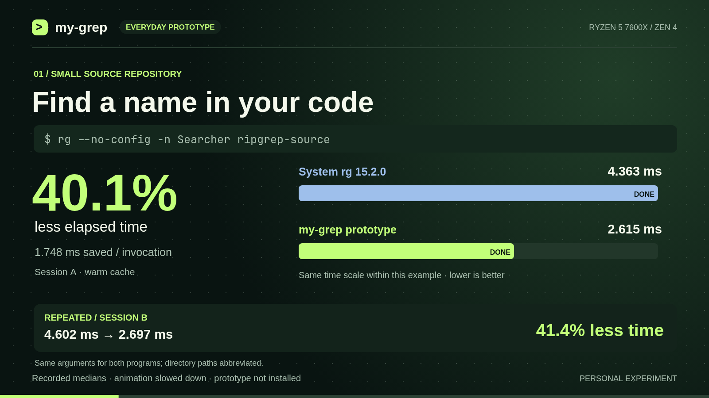

# Everyday searches: revised my-grep film

[Watch the MP4](my-grep-everyday.mp4) · [Animated GIF](my-grep-everyday.gif)
· [Offline player](index.html) · [Friendly article](../../../MY-GREP.md)

52 seconds, 1600 × 900, 24 fps, silent H.264. The GIF contains the same full
story at reduced resolution and frame rate. Download `index.html` and open it
in a browser for chapter controls, session A/B switching, and all 117 results.
The player embeds its measurements and requires no server or internet access;
keep `data.json` beside it if you want its data-download link to work offline.



The film focuses on ordinary word searches and file listing. It illustrates
recorded elapsed-time medians from the isolated everyday prototype, **not the
installed `my-grep` specialist**. It performs no searches while rendering and
does not claim a new benchmark session. Animations slow down millisecond
measurements; each featured chart uses one common time scale for its two bars.
The scales differ between workloads.

| Chapter | Time | What it shows |
| --- | --- | --- |
| Everyday tasks | 0:00 | Word searches, TODOs, file listing |
| Small source tree | 0:05 | `-n Searcher`: 4.363 → 2.615 ms in A; repeat B shown |
| Linux tools | 0:11 | `-n TODO`: 11.594 → 9.329 ms in A; repeat B shown |
| Linux file listing | 0:17 | `--files`: 26.535 → 23.475 ms in A; repeat B shown |
| All 19 directory tasks | 0:23 | 15 met the predeclared repeated-improvement target |
| Why it helps | 0:30 | Worker notifications, scratch reuse, less setup |
| Tradeoffs | 0:36 | General-regex loss versus matched source; CPU cost |
| Takeaway | 0:46 | Measured gains; prototype remains uninstalled |

The command strips include `--no-config`, matching the measurements. The
intro gives abbreviated task examples; paths are shortened throughout the
film. The original absolute paths and all arguments remain in `data.json`.
The featured baseline is installed `/usr/bin/rg` 15.2.0. The regression
scene explicitly distinguishes it from the equally built source reference.

The complete confirmation had 97 PASS, 19 INCONCLUSIVE and 1 FAIL in **each**
session. The overall no-regression gate **failed**. The general-regex loss was
4.31% / 4.55% versus the matching source build, with per-case 95% ratio intervals
entirely above the material regression bound. Those same medians were about
1% better than the system package. The short source-tree word search consumed
17–27% more CPU time. These limits appear in the video and article.

## Data and verification

[Pinned complete report](https://github.com/gardnmi/ripgrep/tree/55279a6c2e16c5bf8b441518d0f4d4f91c493060/benchmarks/assembly/everyday)
contains protocols, inputs, all observations, confidence intervals, slower
cases, CPU costs, source patch, binary hashes and rejected approaches.

The [generator](../../../scripts/assembly/everyday_film.py) reads both final
session files, verifies output equivalence and matching binary/manifest
identities, and reconstructs elapsed and CPU medians from raw observations.
It derives the 15/19 count using the recorded target, without dropping cases.
The [renderer](../../../scripts/assembly/everyday_render.mjs) checks every
table cell in both sessions, playback, chapter controls, mobile overflow and
canvas text bounds. Key frames were visually inspected as well.

- [Derived data and original-file SHA-256 hashes](data.json)
- [Browser/render validation](render-validation.json)
- [Video metadata and decode validation](media-validation.json)
- [Asset checksums](SHA256SUMS)
- [Canvas/HTML source](../../../scripts/assembly/everyday_film.html)

This publication changes documentation and presentation only. It does not
install either experimental executable or modify the original measurements.

## Reproduce the animation

From the root of this personal fork, with Python 3, Node, Chromium and FFmpeg
available. These commands export the existing records; they do not rerun a
benchmark. Playwright's screenshot API follows its
[official documentation](https://playwright.dev/docs/api/class-page#page-screenshot).

```bash
mkdir -p target/everyday-film-input target/everyday-film-deps
git archive 55279a6c2e16c5bf8b441518d0f4d4f91c493060 \
  benchmarks/assembly/everyday | tar -x -C target/everyday-film-input
npm install --prefix target/everyday-film-deps playwright-core@1.63.0
python3 scripts/assembly/everyday_film.py \
  target/everyday-film-input/benchmarks/assembly/everyday target/everyday-film
systemd-run --user --scope --collect \
  -p MemoryMax=4G -p MemorySwapMax=0 -p OOMPolicy=kill \
  node scripts/assembly/everyday_render.mjs \
  target/everyday-film target/everyday-film-deps
```

Append `--preview` to validate and export stills without encoding the film.
The default Chromium location is `/usr/bin/chromium`; override it with the
`CHROMIUM` environment variable. Liberation Sans and JetBrainsMono Nerd Font
were used here; installed fonts and browser versions affect rasterization.
The renderer records its versions and limits the video encoder to two threads.

To produce the full GIF from the finished MP4, use a two-pass palette:

```bash
ffmpeg -y -threads 2 -i target/everyday-film/my-grep-everyday.mp4 \
  -vf 'fps=10,scale=960:-1:flags=lanczos,palettegen=stats_mode=diff' \
  -filter_threads 1 -frames:v 1 target/everyday-film/palette.png
ffmpeg -y -threads 2 -i target/everyday-film/my-grep-everyday.mp4 \
  -i target/everyday-film/palette.png \
  -lavfi 'fps=10,scale=960:-1:flags=lanczos[x];[x][1:v]paletteuse=dither=bayer:bayer_scale=3' \
  -filter_complex_threads 1 -loop 0 target/everyday-film/my-grep-everyday.gif
```

AI-assisted personal fork. No upstream submission or endorsement.
